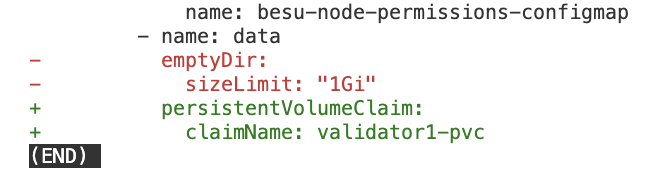
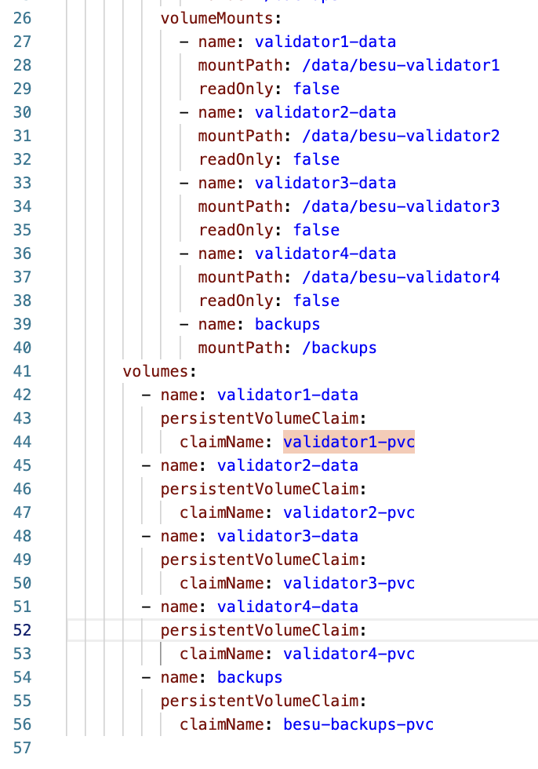
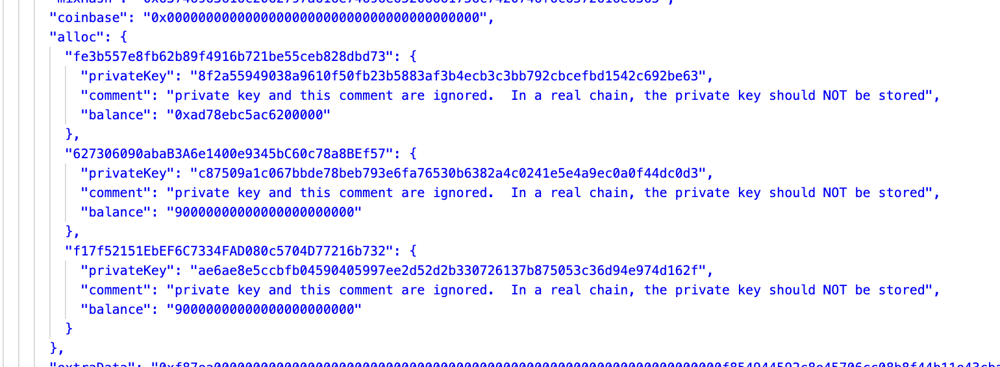
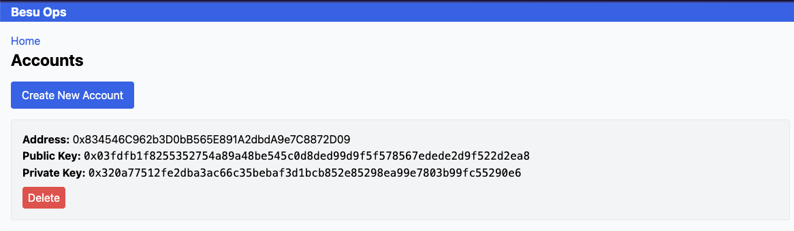

# How this Works

You can [install](./installation.md) the besu cluster and operations locally and test out [backup and restore](./backupRestore.md).

The key elements of this demonstration which enable this backup/restore functionality is described below.

# kubectl access

The Besu Ops dashboard has been given cluster role permissions in [role-pod-reader.yaml](../besu-ops/k8s/role-pod-reader.yaml) and [rolebinding-pod-reader](../besu-ops/k8s/rolebinding-pod-reader.yaml) to allow it to execute kubectl commands within the namespace. 

It uses [kubectl](../besu-ops/src/lib/k9s.ts) to provide the data for the dashboard and to scale the services.

# shared volumes

Our [IBFT2](../ibft2/) cluster was initially cloned from [the Consensys Besu example](https://github.com/Consensys/quorum-kubernetes/tree/master/playground/kubectl/quorum-besu/ibft2). 

It was modified to use persistent-volume-claims (PVC) for the data directory for each node.

For example, [validator1-pvc.yaml](../ibft2/statefulsets/validator1-pvc.yaml) was added and referenced by [validator1-statefulset.yaml](../ibft2/statefulsets/validator1-statefulset.yaml) rather than an empty dir:

Each node's PVC is then also mounted by the [deployment](../besu-ops/k8s/deployment.yaml) of the Besu Dashboard:

They are mounted as `readOnly: false` so that the restore functionality works.

# funding wallets / transactions

The values used for creating transactions were taken from the configuration.

The Besu cluster setup specifies a [genesis configmap](ibft2/configmap/besu-genesis-configmap.yaml) with some test accounts (note the comment about NOT doing this in a real production cluster!)

Those private keys were used as the 'from' account.

From the 'Accounts' option on the dashboard:

You can create new accounts:

Which are just local key/value pairs. You could easily just do this using other means to ultimately just get a wallet address for the 'to' account in the transaction.
