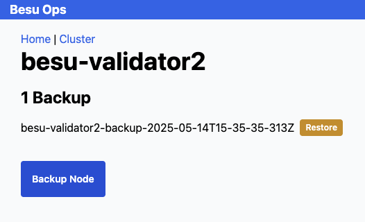

[back](../readme.md).

# Back up and Restore

It's assumed you've installed the Besu cluster and Operations dashboard as described [here](./installation.md)

To use the dashboard, open `k9s` and use `shift+f` to port-forward port 3000 on your localhost:

# Backup flow

To demonstrate backup and restore on our cluster, we will:

1. Create an initial transaction.
2. Use the block explorer to view/verify the transaction
3. Take a backup (by first scaling down the nodes)
4. Create another transaction (after scaling the nodes back up)
5. Restore the backup (after scaling the nodes back down)
6. Demonstrate the cluster has been rolled back 

## Creating an Initial Transaction

Navigate to [localhost:3000](http://localhost:3000):

and choose 'Cluster'.

Then create a transfer from the seeded account:

.

Navigate back to the cluster, and choose the block explorer from any node to see the transaction:

You can see that flow here:

## Backing up the Node(s)

To back-up the cluster, we first manually scale-down the besu node or nodes we'd like to back up as per recommended practice.

We then take a back-up copy of the data, and scale the besu node(s) back up.

If we choose the 'scale' option for the node, it will display the current node status, and a 'scale-down' option if the node is running:

Going back to the cluster view, we can then move to the 'backup' option:

This will take a disk copy and metadata snapshot of the disk volume which is shared between the operations console and the node's persistent volumn claim.

We can now navigate back to the 'scale' option for the node and scale the node back up.

(Notice the 'not found' status is because the node has been scaled down, and so is currently not running on our cluster)

You can see that flow for all nodes in this here:

## Restore

To demonstrate the restore, we should now make additional transactions in order to observe them missing after we restore our backup.

Note: If we only tried to restore one node, it would become eventually consistent and see these new transactions, so for the purpose of testing/this demonstration,
we sping down all four nodes in the cluster.

That flow is represented in this flow:

Now that we have an additional transaction, we can scale down our nodes as we did when we took our backup.

We can then navigate to 'backup' for each node and choose the 'Restore' button next to the backup.

We can then spin the cluster back up, as seen here:

## Verify

Having made an additional transaction after our backup, we should now be able to use the block explorer for any node to observe that we just have our initial transaction, as seen here:

Notice that we can continue to use our cluster and make additional transactions, which will be different from the transaction we "lost" due to restoring from a previous backup.

# Wrapping Up

You can now read more about [how this works](./about.md) or [go back](../README.md)

