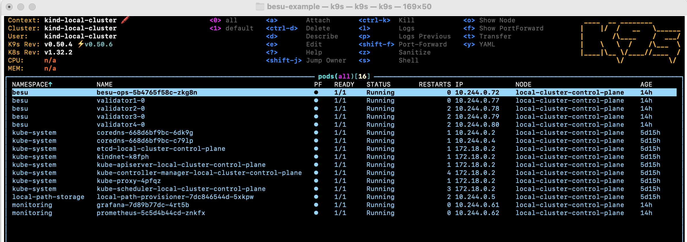

[back](../readme.md)
# Installation

## Installing Kubernetes (locally)

Run `./installK8S.sh` which uses [local-kubernetes](https://github.com/aaronp/local-kubernetes) to install a local [Kind](https://kind.sigs.k8s.io/) cluster, [K9S](https://k9scli.io/) and [ArgoCD](https://argo-cd.readthedocs.io/en/stable/) (which we won't use here).

## Installing Besu Cluster

There is a four-node kubernetes IBFT2 Besu cluster which you can install using [the deploy script](../ibft2/deploy.sh)

## Installing the Besu Operations Dashboard

Lastly, this project contains a basic dashboard simple cluster operations.

You can install that using `make deploy` in the [besu-ops](../besu-ops/) directory.

If you run `k9s`, you should now see this:

## Next - Using the Dashboard

You can now test out your cluster, backup and restore by following the steps [here](./backupRestore.md)